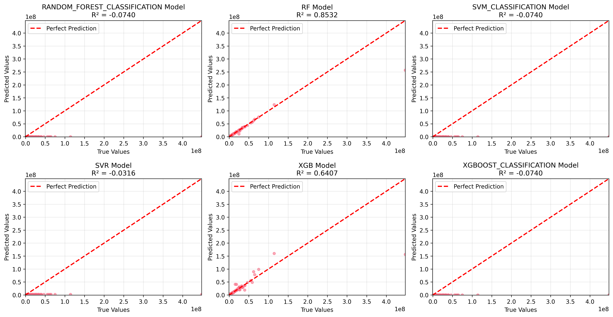

# 🏙️ Predicting Urban Building Electricity Consumption using Machine Learning

This project uses machine learning models (XGBoost, Random Forest, SVR) to predict electricity consumption of urban buildings based on the **Seattle Building Energy Benchmarking 2016 dataset**. It includes data preprocessing, model training, evaluation, and a fully interactive Flask dashboard.

---

## 📁 Project Structure

```
Predicting-Urban-Building-Electricity-Consumption/
├── app.py                      # Flask web application
├── main.py                    # Main ML pipeline controller
├── data/
│   └── 2016-building-energy-benchmarking.csv
├── models/
│   └── train_xgboost.py       # XGBoost training logic
├── preprocessing/
│   └── clean_data.py          # Data preprocessing pipeline
├── evaluation/
│   └── evaluate_models.py     # Model evaluation and plotting
├── outputs/
│   ├── X_train.csv, y_test.csv ...
│   ├── predictions_xgb.csv
│   ├── model_xgb.pkl
│   └── charts/
│       ├── feature_importance_xgb.png
│       ├── predicted_vs_actual_all_models.png
│       ├── model_comparison_metrics.png
│       └── residuals_analysis.png
├── templates/
│   ├── index.html
│   └── dashboard.html
└── static/ (optional)
```

---

## 🔧 How to Run

1. **Clone the repository** (or copy the project folder)

2. **Create virtual environment (optional but recommended)**  
venv\Scripts\activate
   ```bash
   python -m venv venv
   venv\Scripts\activate  # Windows
   ```

3. **Install dependencies**  
   ```bash
   pip install -r requirements.txt
   ```

4. **Run the ML Pipeline**  
   ```bash
   python main.py
   ```

5. **Launch the Dashboard**  
   ```bash
   python app.py
   ```

6. Visit: [http://localhost:5000/dashboard](http://localhost:5000/dashboard)

---

## 📊 Features

| Module        | Description                                                                 |
|---------------|-----------------------------------------------------------------------------|
| ✅ Preprocessing | Handles missing values, encoding, scaling, and feature selection          |
| ✅ XGBoost      | Trained with both default and tuned parameters                             |
| ✅ Evaluation   | Calculates MAE, RMSE, R² + residual analysis and feature importance charts |
| ✅ Dashboard    | Interactive Flask web app with chart visualization and modal enlargement   |

---

## 📦 Dataset Used

**Source:** [Kaggle - Seattle Building Energy Benchmarking 2016](https://www.kaggle.com/datasets/city-of-seattle/sea-building-energy-benchmarking)

- Total samples: ~3,300
- Features: Property type, GFA, EnergyStar score, electricity usage, etc.
- Target: `SiteEnergyUse(kBtu)`

---

## 📷 Dashboard Preview




---

## 🧠 Future Improvements

- Add model comparison (XGBoost vs RandomForest vs SVR)
- Allow user-uploaded dataset via dashboard
- Export report (PDF/HTML)
- Add auto-retraining capability

---

## 👨‍💻 Authors

- Nicholas Tay Jun Yang (Team Lead)
- Loh Jia Xian
- Tan Zhe Khang
- Cheeng Huai En

---

## 📜 License

This project is developed for academic and educational purposes under Multimedia University (MMU).
